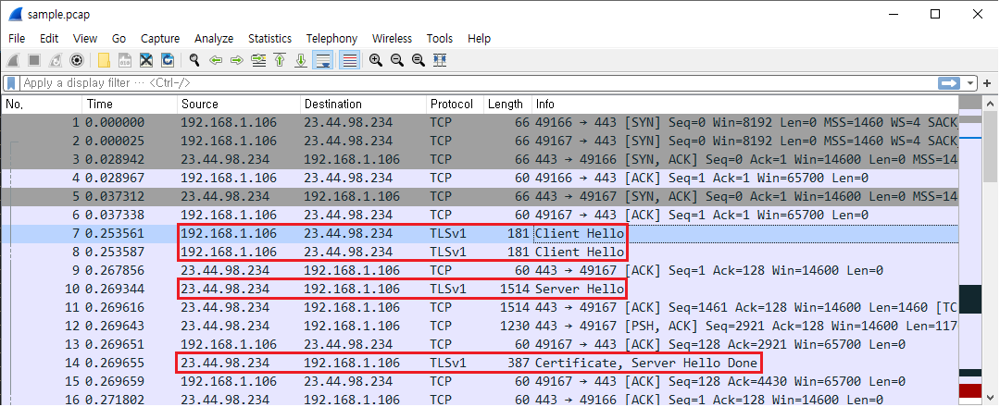

TLSniff
==========
`TLSniff` is a fast and simple tool to analyze the SSL/TLS protocol data frame named `record`. It is a libpcap-based application to parse a network data stream and reassemble the TLS records from the IP/TCP packet payload.


## Table Of Contents

- [Description](#description)
- [Installation](#installation)
- [Usage](#usage)
- [License](#license)

## Description

#### 1. What is TLS record?
Transport Layer Security (TLS), also known as Secure Socket Layer (SSL), is one of the widely used standards of the communication protocol that supports cryptographically protected tunneling for application-level data transmission. TLS provides a secure channel between two communicating peers by fragmenting their messages into a series of manageable block named `TLS record`. Once two hosts successfully negotiated cryptographic keys and parameters for confidentiality, each `record` is independently protected under selected keying materials. The encryption puts constraints on payload inspection for high-level layers (i.e., application layer); however, in other aspects, `record` ironically provides some new significant information, such as the preference of cipher suite, certificate, server name indication (SNI), and so on. In this regard, the stream of `record` is believed to reflect unique application natures or behavioral characteristics of a communicating party. (See https://tools.ietf.org/html/rfc8446 for details.)

#### 2. When is TLSniff useful?
Although there are so many network traffic analyzers that support inspection of the TLS layer, they hardly keep the original form and order of `record` frames due to several issues including retransmission, out-of-order packets, packet loss, etc. Besides, each part of a single `record` can occupy consecutive bits within the different packet payloads because the `record` size can be larger than the maximum transmission unit allowed for the packet delivery. Even when the size of a `record` is small enough to be placed in a single packet, the TLS protocol does not prefer to frequently transmit data blocks. Hence, it crams a bundle of consecutive `records` into one packet, and the remaining bits are truncated and passed to the next packet, and so on. Most toolkits aim for analysis of packet-level delivery rather than only TLS-specific message. Compared to these, `TLSniff` is intended to reconstruct the original TLS `record` stream from the segmented payload data. This tool reads packet data from a pcap format file or a live network interface and writes a `record` sequence of each TCP conversation sharing the same pair of source/destination IP addresses and port numbers on an output file.

#### 3. Key features
 * TLSniff supports SSL 3.0, TLS 1.0, TLS 1.1, TLS 1.2, TLS 1.3, and an obsolete version SSL 2.0 as well.
 * Process hundreds of thousands of packets per second. (≈ 100Mb/s)
 * Identify connected server name.

## Installation

#### Build on Linux:

```shell
$ sudo apt-get install libpcap-dev
$ sudo apt-get update
$ sudo apt-get upgrade

$ git clone https://github.com/cvlian/TLSniff
$ cd TLSniff
$ sudo make all
```

## Usage
    
    Usage: tlsniff [options] ...
    
    Capture packets:
        -i <interface>   : Name of the network interface
        -r <input-file>  : Read packet data from <input-file>
    Capture stop conditions:
        -c <count>       : Set the maximum number of packets to read
        -d <duration>    : Stop after <duration> seconds
        -m <rcd count>   : Set the maximum number of records to read
    Processing:
        -l <rcd count>   : Set the maximum number of records to be extracted per flow
        -q               : Print less-verbose record information
        -x               : Write <output-file> in hexadecimal form
    Output:
        -w <output-file> : Write all SSL/TLS record data to <output-file>
                           (or write its results to stdout)
    Others:
        -h               : Displays this help message and exits


#### TLS record extraction with Pcap File:
    $ sudo tlsniff -r example.pcap

</br>It will print the transmitted record messages and their directions between two hosts.</br>

</br></br></br>


In wireshark,</br> 

</br></br></br>

#### TLS record extraction on Live Network Interface:
    $ sudo tlsniff -i eth0 -w example.csv

</br>Write a csv file with less verbose mode.</br>

</br></br></br>

All record data will be written in the order they arrived.</br>

</br></br></br>


#### Capture TLS records during 1 minute (60 seconds)
    $ sudo tlsniff -d 60 -i eth0 -w example.csv

#### Capture first 100 TLS records
    $ sudo tlsniff -m 100 -i eth0 -w example.csv


## License
TLSniff is provided under a BSD 3-Clause License.
